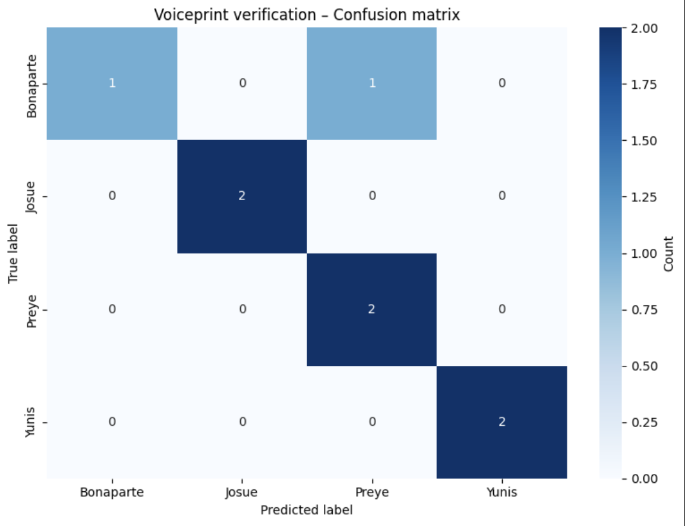

# Voice Recognition & Voiceprint Verification

**Formative 2 — Sound Data Collection and Processing + Voiceprint Verification**

A pipeline for **speaker identification** from voice: load local audio, extract acoustic features, and train a voiceprint verification model. All processing runs in a Jupyter notebook with no cloud dependencies.

---

## Overview

| Component | Description |
|-----------|-------------|
| **Input** | Local audio in `VoiceModel/audio_samples/` (WAV, MP3, FLAC, OGG, M4A) |
| **Labels** | Derived from filenames (e.g. `Bonaparte-REC.wav` → `Bonaparte`) |
| **Features** | MFCCs (mean/std), spectral roll-off, energy (RMS); exported as CSV |
| **Model** | Random Forest classifier for voiceprint verification |
| **Outputs** | `audio_features.csv`, trained model + scaler + label encoder (joblib) |

---

## Features

- **Audio loading** from `VoiceModel/audio_samples/` (or `audio_samples/` at project root)
- **Label extraction** from filenames: segment before the first `-` (e.g. `Bonaparte-REC.wav` → `Bonaparte`)
- **Visualizations**: waveforms and spectrograms for sample files
- **Augmentations**: pitch shift, time stretch, background noise (1 original + 3 augmented clips per file)
- **Feature extraction**: MFCCs, spectral roll-off, and energy in a pandas DataFrame, saved to CSV
- **Voiceprint model**: Random Forest; evaluated with Accuracy, F1-Score, and Log Loss
- **Saved artifacts**: model, scaler, and label encoder for inference (e.g. CLI or API)

---

## Evaluation

The model is evaluated on a held-out test set. Metrics reported in the notebook:

- **Accuracy** — overall correct predictions  
- **F1-Score** (macro) — per-class balance  
- **Log Loss** — probabilistic calibration  

### Confusion matrix

The confusion matrix below shows per-speaker prediction vs. true labels on the test set.



---

## Project structure

```
VoiceModel/
├── README.md
├── voice_recognition.ipynb      # Main notebook: load → augment → features → train
├── audio_samples/               # Place .wav / .mp3 / .flac / .ogg / .m4a here
├── audio_features.csv           # Generated: extracted features (one row per clip)
├── voiceprint_model.joblib      # Generated: trained Random Forest
├── voice_scaler.joblib          # Generated: StandardScaler
├── voice_label_encoder.joblib   # Generated: label → integer mapping
└── myenv/                       # Optional virtual environment
```

---

## Setup

1. **Python**: 3.9 or newer.

2. **Install dependencies** (or run the notebook’s first cell):

   ```bash
   pip install librosa soundfile pandas matplotlib seaborn scikit-learn joblib
   ```

3. **Audio data**: Add files under `VoiceModel/audio_samples/` with names like `SpeakerName-REC.wav` so the speaker label is the part before the first `-`.

---

## Usage

1. Open `VoiceModel/voice_recognition.ipynb` in Jupyter, VS Code, or Cursor.
2. Run all cells in order:
   - Install dependencies (if needed) → imports & config → load dataset  
   - Visualize waveforms/spectrograms → apply augmentations  
   - Extract features (DataFrame → `audio_features.csv`) → train Random Forest → save artifacts  
3. **Outputs**:
   - `audio_features.csv`: one row per clip (original + augmented); columns: `label`, `source`, and feature columns (`mfcc_mean_0` … `energy_std`).
   - In `VoiceModel/` (or cwd): `voiceprint_model.joblib`, `voice_scaler.joblib`, `voice_label_encoder.joblib` for inference.

---

## Feature pipeline (DataFrames)

Features are produced by `extract_audio_features(y, sr)`, which returns a **dict** of scalar values. The notebook builds a list of dicts (one per clip) and builds the feature table:

```python
feature_rows = [
    {"label": label, "source": source_name, **extract_audio_features(y, sr)}
    for y, sr, label, source_name in all_audio_for_features
]
df_audio = pd.DataFrame(feature_rows)
```

The pipeline is DataFrame-based: one row per clip, named columns, then `df_audio.to_csv(...)` and `df_audio[feature_cols]` for training.
